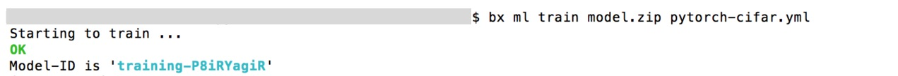
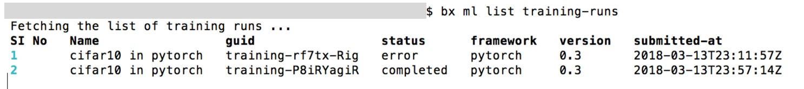
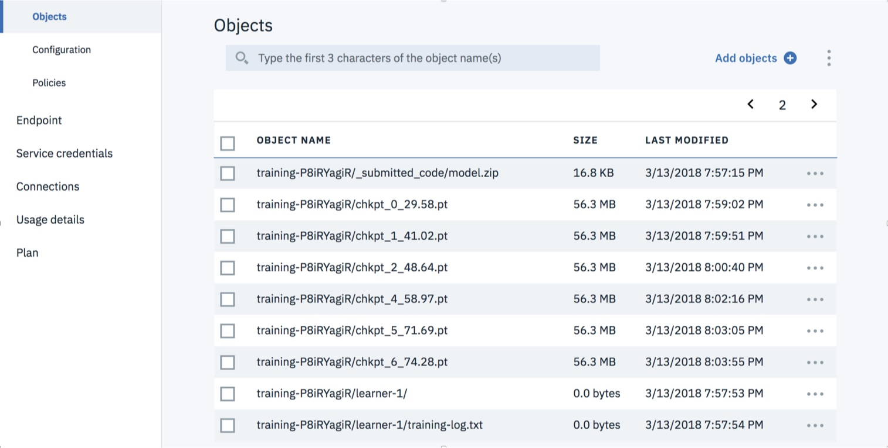

# Train CIFAR10 with PyTorch using IBM Watson Studio
The code here is forked from [kuangliu](https://github.com/kuangliu/pytorch-cifar) and adapted for submitting the model to IBM Watson Machine Learning on Watson Studio for training. It is meant to get you quick-started. We hope you have some fun running your first models on IBM Cloud.

## Quickstart Local

If executing locally, this python script only needs *pytorch* and *torchvision* . Install as described on the [pytorch webpage](http://pytorch.org). Then clone the repo and run the following to train a VGG19 locally:

```
python3 download_cifar.py
python3 main.py --lr 0.01 --epochs 100 --model vgg19
```

### General Syntax
```
usage: main.py [-h] [-l] [--lr LR] [--resume] [--cifar_path CIFAR_PATH]
               [--checkpoint_path CP] [--epochs EPOCHS]
               [--model MODEL]

PyTorch CIFAR10 Training

optional arguments:
  -h, --help            show this help message and exit
  -l                    lists all available models (default: False)
  --lr LR               learning rate (default: 0.1)
  --resume, -r          resume from checkpoint (default: False)
  --cifar_path          path to cifar tar.gz (default: ./cifar10)
  --checkpoint_path CP  checkpoint path (default: .)
  --epochs EPOCHS       no of epochs (default: 10)
  --model MODEL         Model type: vgg16,... (default: vgg16)
```


## How can I run code on IBM Watson Studio (for free) ?

Below are the steps to setup your account to run your ML training runs in the cloud on different numbers and types of GPUs. After setup, you will be able to train your machine learning models on Watson studio in less than a minute! 

If you are interested in Watson Studio in general we recommend to read more about it here: [https://www.ibm.com/cloud/watson-studio](https://www.ibm.com/cloud/watson-studio)

### Step 0: Fork/clone me!

### Step 1: Download CIFAR10 to your machine

```
python3 download_cifar.py
```

### Step 1b: Test the code on your own machine (optional)

```
python3 main.py --lr 0.01 --epochs 100 --model vgg19
```
Now to run the code on Watson, all you need is an IBM Cloud account and a cloud storage bucket to hold the input data (CIFAR10) and output data (models, performance stats).

### Step 2: Create an account on IBM Cloud

Visit [https://console.bluemix.net/](https://console.bluemix.net/) to sign up!

### Step 3: Setup local machine (only needed once)

#### 3.1. Install `bx`

First, the `bx` [CLI](https://console.bluemix.net/docs/cli/reference/bluemix_cli/download_cli.html#download_install) allows you to start and manage IBM cloud instances from the command-line.

OSX:

```
curl -fsSL https://clis.ng.bluemix.net/install/osx | sh
```

Linux:

```
curl -fsSL https://clis.ng.bluemix.net/install/linux | sh
```

Windows:

```
powershell.exe -command "iex (New-Object Net.WebClient).DownloadString('https://clis.ng.bluemix.net/install/powershell')"
```


#### 3.2. Login with your IBM Cloud account:

```
bx login
or:
bx login -sso (if within IBM)
```

#### 3.3. Install `awscli`

The [awscli](https://docs.aws.amazon.com/cli/latest/userguide/) lets you setup and upload data to your buckets.

```
pip install awscli
```

#### 3.4. Install `bx` machine-learning plugin

Lastly, the machine learning plugin for `bx` lets you use the watson ml part of the bluemix cli to start, view, and stop ml jobs on watson.

```
bx plugin install machine-learning
```

### Step 4: Create a bucket

A [bucket](https://datascience.ibm.com/docs/content/analyze-data/ml_dlaas_object_store.html) is like a huge folder in the cloud which you can put and get any file or folder (specifically your datasets) using an api-style interface.

#### 4.1. Create a cloud instance:

First, we create your own personal cloud storage instance to hold your bucket and name the instance `my_instance`.

```
bx resource service-instance-create my_instance cloud-object-storage lite global
bx resource service-instance my_instance
```

#### 4.2. Get credentials:

We then create and get your personal instance credentials naming it `my_cli_key` so that you can create and access your bucket.

Create key and print it:

```
bx resource service-key-create "my_cli_key" Writer --instance-name "my_instance" --parameters '{"HMAC":true}' > /dev/null 2>&1
access_key_id=`bx resource service-key my_cli_key | grep "access_key_id"| cut -d\:  -f2`
secret_access_key=`bx resource service-key my_cli_key | grep "secret_access_key"| cut -d\:  -f2`
echo ""; echo "Credentials:"; echo "access_key_id - $access_key_id"; echo "secret_access_key - $secret_access_key"; echo ""
```

Add `access_key_id` and `secret_access_key` to your awscli profile and name it `my_profile` (leave the other fields as None).

```
aws configure --profile my_profile
```

Copy these keys! You'll need them again a little later.

#### 4.3. Create a bucket:

Now, we make a bucket and name it something unique! Buckets are named globally, which means that only one IBM Cloud account can have a bucket with a particular name.

```
bucket_name=<DEFINE_A_NAME>
```

and run:

```
aws --endpoint-url=http://s3-api.us-geo.objectstorage.softlayer.net s3api create-bucket --bucket $bucket_name --profile my_profile 2>&1
```

### Step 5: Create a Watson ML Instance

#### 5.1. Configure your account

In order to run jobs on Watson, you will need to create an organization and space to hold your jobs. Organization names are also globally unique.

```
org_name=...
space_name=...
bx account org-create $org_name
bx target -o $org_name
bx account space-create $space_name
bx target -o $org_name -s $space_name
```

#### 5.2. Setup a Watson ML Instance

```
bx service create pm-20 lite CLI_WML_Instance
bx service key-create CLI_WML_Instance cli_key_CLI_WML_Instance
instance_id=`bx service key-show CLI_WML_Instance cli_key_CLI_WML_Instance | grep "instance_id"| awk -F": " '{print $2}'| cut -d'"' -f2`
username=`bx service key-show CLI_WML_Instance cli_key_CLI_WML_Instance | grep "username"| awk -F": " '{print $2}'| cut -d'"' -f2`
password=`bx service key-show CLI_WML_Instance cli_key_CLI_WML_Instance | grep "password"| awk -F": " '{print $2}'| cut -d'"' -f2`
url=`bx service key-show CLI_WML_Instance cli_key_CLI_WML_Instance | grep "url"| awk -F": " '{print $2}'| cut -d'"' -f2`
export ML_INSTANCE=$instance_id
export ML_USERNAME=$username
export ML_PASSWORD=$password
export ML_ENV=$url
```

### Step 6: Upload your dataset (CIFAR10) to your bucket:

This will upload our dataset to the bucket we created:

```
aws --endpoint-url=https://s3-api.us-geo.objectstorage.softlayer.net --profile my_profile s3 cp cifar10/  s3://$bucket_name/cifar10 --recursive
```

You have completed the one-time setup! Now, we can start sending jobs to Watson.

### Step 7: Modify `pytorch-cifar.yml`

This yaml file holds all the information needed for our job including what bucket, ml framework, and computing instance to use.

#### 7.1. Copy the template manifest:

```
cp pytorch-cifar-template.yml pytorch-cifar.yml
```
#### 7.2. Edit `pytorch-cifar.yml`:

Add your author info and replace the values of `aws_access_key_id`, `aws_secret_access_key`, and `bucket` in `pytorch-cifar.yml` with your storage instance credentials and your chosen bucket name from before for both the data and results references.

```yaml
model_definition:
  framework:
#framework name and version (supported list of frameworks available at 'bx ml list frameworks')
    name: pytorch
    version: 0.3
#name of the training-run
  name: cifar10 in pytorch
#Author name and email
  author:
    name: John Doe
    email: johndoe@ibm.com
  description: This is running cifar training on multiple models
  execution:
#Command to execute -- see script parameters in later section !!
    command: python3 main.py --cifar_path ${DATA_DIR}/cifar10
      --checkpoint_path ${RESULT_DIR} --epochs 10
    compute_configuration:
#Valid values for name - k80/k80x2/k80x4/p100/p100x2/v100/v100x2
      name: k80
training_data_reference:
  name: training_data_reference_name
  connection:
    endpoint_url: "https://s3-api.us-geo.objectstorage.service.networklayer.com"
    aws_access_key_id: < from cloud portal >
    aws_secret_access_key: < from cloud portal >
  source:
    bucket: < bucket name >
  type: s3
training_results_reference:
  name: training_results_reference_name
  connection:
    endpoint_url: "https://s3-api.us-geo.objectstorage.service.networklayer.com"
    aws_access_key_id: < from cloud portal >
    aws_secret_access_key: < from cloud portal >
  target:
    bucket: < bucket name >
  type: s3
```

Notice that under execution in the yaml file, we have already specified a command that will be executed when the job reaches the server.

```
python3 main.py --cifar_path ${DATA_DIR}/cifar10
      --checkpoint_path ${RESULT_DIR} --epochs 10
```

This will execute main.py, which starts a training run of a specified model. Since no model is specified, it will train the default model, vgg16, for 10 epochs using the dataset in the bucket we created.

### Step 8: Send code to run on Watson Studio!

#### 8.1. Zip code into a file:
```
zip model.zip main.py models/*
```

#### 8.2. Send your code and manifest to IBM Watson Studio:
```
bx ml train model.zip pytorch-cifar.yml
```



That's it! The command should generate a training ID for you, meaning our model has started training on Watson!


### Step 9: Monitor training (Optional)

#### We can check the status of training using the `bx ml list` command:
```
bx ml list training-runs
```


#### We can also continuously monitor a training run by using the `bx ml monitor` command:
```
bx ml monitor training-runs < trainingID >
```


As training proceeds, you should also see results from the training process being copied to the results bucket specified in your training job `yaml` file - `training_results_references.target bucket`.



You can also inspect the status of training by downloading and viewing the training log file which has been copied to the result bucket. This is useful in debugging errors and failed jobs.

#### To do this, we run:
```
aws --endpoint-url=https://s3-api.us-geo.objectstorage.softlayer.net --profile my_profile s3 cp s3://my_bucket/ < trainingID Rig >/learner-1/training-log.txt -
```

### Additional Information

See [https://dataplatform.ibm.com/docs/content/analyze-data/ml_dlaas_working_with_new_models.html](https://dataplatform.ibm.com/docs/content/analyze-data/ml_dlaas_working_with_new_models.html)


## Using the tool
```
usage: main.py [-h] [-l] [--lr LR] [--resume] [--cifar_path CIFAR_PATH]
               [--checkpoint_path CP] [--epochs EPOCHS]
               [--model MODEL]

PyTorch CIFAR10 Training

optional arguments:
  -h, --help            show this help message and exit
  -l                    lists all available models (default: False)
  --lr LR               learning rate (default: 0.1)
  --resume, -r          resume from checkpoint (default: False)
  --cifar_path          path to cifar tar.gz (default: ./cifar10)
  --checkpoint_path CP  checkpoint path (default: .)
  --epochs EPOCHS       no of epochs (default: 10)
  --model MODEL         Model type: vgg16,... (default: vgg16)
```

### Example for a vgg19:

```
# on local machine:
python3 main.py --lr 0.01 --epochs 100 --model vgg19

# in Watson Machine Learning yaml file:
python3 main.py --cifar_path ${DATA_DIR}/cifar10
      --checkpoint_path ${RESULT_DIR}
      --epochs 100 --model vgg19 --lr 0.01
```

### Available Models:

```
DPN26  ( <function DPN26 at 0x1129dbc80> )
DPN92  ( <function DPN92 at 0x112a01048> )
DenseNet121  ( <function DenseNet121 at 0x1129e10d0> )
DenseNet161  ( <function DenseNet161 at 0x1129e16a8> )
DenseNet169  ( <function DenseNet169 at 0x1129e1598> )
DenseNet201  ( <function DenseNet201 at 0x1129e1620> )
GoogLeNet  ( <class 'models.googlenet.GoogLeNet'> )
Inception  ( <class 'models.googlenet.Inception'> )
LeNet  ( <class 'models.lenet.LeNet'> )
MobileNet  ( <class 'models.mobilenet.MobileNet'> )
MobileNetV2  ( <class 'models.mobilenetv2.MobileNetV2'> )
PNASNetA  ( <function PNASNetA at 0x112a018c8> )
PNASNetB  ( <function PNASNetB at 0x112a01ea0> )
PreActBottleneck  ( <class 'models.preact_resnet.PreActBottleneck'> )
PreActResNet101  ( <function PreActResNet101 at 0x1129ed730> )
PreActResNet152  ( <function PreActResNet152 at 0x1129ed7b8> )
PreActResNet18  ( <function PreActResNet18 at 0x1129ed1e0> )
PreActResNet34  ( <function PreActResNet34 at 0x1129ed620> )
PreActResNet50  ( <function PreActResNet50 at 0x1129ed6a8> )
ResNeXt29_2x64d  ( <function ResNeXt29_2x64d at 0x1129eea60> )
ResNeXt29_32x4d  ( <function ResNeXt29_32x4d at 0x1129ed0d0> )
ResNeXt29_4x64d  ( <function ResNeXt29_4x64d at 0x1129eef28> )
ResNeXt29_8x64d  ( <function ResNeXt29_8x64d at 0x1129ed048> )
ResNet101  ( <function ResNet101 at 0x1129ee840> )
ResNet152  ( <function ResNet152 at 0x1129ee8c8> )
ResNet18  ( <function ResNet18 at 0x1129ee2f0> )
ResNet34  ( <function ResNet34 at 0x1129ee730> )
ResNet50  ( <function ResNet50 at 0x1129ee7b8> )
SENet18  ( <function SENet18 at 0x112a01378> )
SepConv  ( <class 'models.pnasnet.SepConv'> )
ShuffleNet  ( <class 'models.shufflenet.ShuffleNet'> )
ShuffleNetG2  ( <function ShuffleNetG2 at 0x1129e1c80> )
ShuffleNetG3  ( <function ShuffleNetG3 at 0x1129ee158> )
VGG11  ( config in  <class 'models.vgg.VGG'> )
VGG13  ( config in  <class 'models.vgg.VGG'> )
VGG16  ( config in  <class 'models.vgg.VGG'> )
VGG19  ( config in  <class 'models.vgg.VGG'> )
```


### Accuracy as reported by `kuangliu`:
| Model             | Acc.        |
| ----------------- | ----------- |
| [VGG16](https://arxiv.org/abs/1409.1556)              | 92.64%      |
| [ResNet18](https://arxiv.org/abs/1512.03385)          | 93.02%      |
| [ResNet50](https://arxiv.org/abs/1512.03385)          | 93.62%      |
| [ResNet101](https://arxiv.org/abs/1512.03385)         | 93.75%      |
| [MobileNetV2](https://arxiv.org/abs/1801.04381)       | 94.43%      |
| [ResNeXt29(32x4d)](https://arxiv.org/abs/1611.05431)  | 94.73%      |
| [ResNeXt29(2x64d)](https://arxiv.org/abs/1611.05431)  | 94.82%      |
| [DenseNet121](https://arxiv.org/abs/1608.06993)       | 95.04%      |
| [PreActResNet18](https://arxiv.org/abs/1603.05027)    | 95.11%      |
| [DPN92](https://arxiv.org/abs/1707.01629)             | 95.16%      |

## Enjoy
Hendrik Strobelt (IBM Research), Evan Phibbs (IBM Research), Victor C. Dibia (IBM Research)
